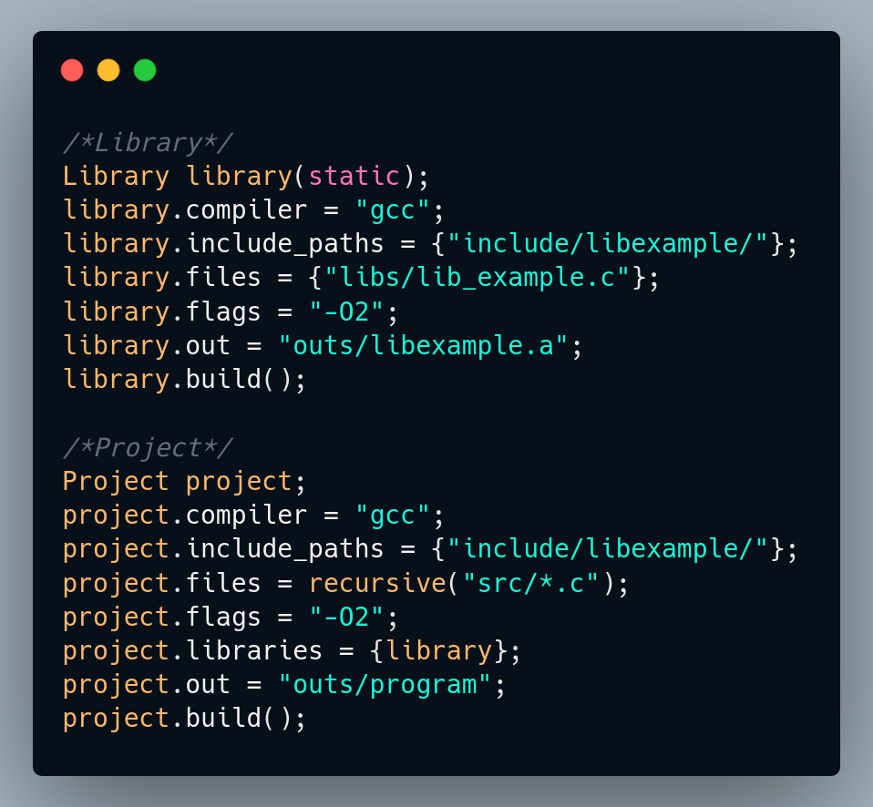

# Cate: A Build System for the sane.
<h3 align="center">
  Cate is a simple build for C/C++ with C-like syntax.
</h3>

  

## Introduction
Cate is a simple build system for the C family of languages (minus C#). While not as feature rich as CMake or as fast as Ninja-build, Cate achieves a simple syntax that doesn't feel much different to an actual programming language.

Unlike CMake, Cate is not Turing complete. It doesn't feature if-statements, loops, functions, or anything that is not related to building. 

## Notes
**Cate will change a lot in the following days, look out for updates that *might* break your project**

- Cate was written by a beginner programmer and its codebase is terrible. Fell free to rewrite it if you want!
- No Windows support.
- Cate uses robin_hood hashing, since it's 20% more efficient (on average)
- Cate **does not** support `\"` characters in string literals.

## Building Cate
A Build system needs to be built too. this step will be easy though! 
Dependencies are:
- A *NIX operating system (Linux, BSD, MacOS, etc)
- A C++17 compiler (I used g++)
- GNU Flex 2.6.4 or greater ([read setup here](flex_setup.md))
- GNU Make (if you don't have Cate already installed)

### Building with GNU Make
To build with Make, run `make`. or if you want a smaller executable, run `make smol`
### Building with Cate
To build with Make, run `cate build.cate`,  or if you want a smaller executable, run `cate smol.cate`
### Installing
To install, use `sudo cate install.cate`, or `sudo make install` if you prefer installing with make.

## How to use Cate
To build another project, run `cate [filename.ending with .cate]` (example: `cate build.cate`)
The `.cate` extension is not required in the command.  

To change the thread count, add the `-t[number]`flag **before** the filename. there's a bug that doesn't work with it after the filename.

Cate will only build **one** file per command.

For starting a project, look at the [examples folder](examples/) or continue reading.

## Syntax things
Cate follows an object syntax. it'd be very easy to read for C/C++ programmers. Semicolons and commas are optional.

**IMPORTANT NOTE:** Cate **does not** support `\"` characters in string literals.

### Classes
There are only two classes you can create.
1. `Project1: A thing that builds an executable. 

**Example**: `Project proj;`

2. `Library(type)`: A thing that builds a library of specified type (can be `static` xor `dynamic`) 
**Example**: `Library slib(static);`
**Example**: `Library dlib(dynamic);`

### Class properties
Just like in C/C++, properties follow the `object.property = Thing;`.
 **Note:** a class property cannot be set to another's.

Here are the classes' properties:
- `String out` is the output file. can only be a string literal. Not required (defaults to identifier).
**Example**: `proj.out = "outs/yay";`
- `Array files` holds the filenames of the class's sources. it can be set to an array, an array with `recursive()`, or `recursive(/*stuff*/)`. Required. 
**Example**: `proj.files = {"main.cpp", recursive("more/*.cpp")} `
- `Array libraries|libs` holds the filenames of the class's libraries. it can only be set to an array. libraries can be either local libraries in a folder or libraries in `/usr/lib`. Not required. 
**Example**: `proj.libraries = {"SDL2", "lib_out/local_lib.a"}` 
- `Array includes|include_paths` holds the folder names of the class's includes. can only be set to an array. 
**Example**: `proj.includes = {"lib_out/"}`
- `String flags` is the class's compiler flags. can only be a string. Not required. 
**Example**: `proj.flags = "-O2";`
- `String compiler` is the class's compiler, it can only be a string. Required. 
**Example**: `proj.compiler = "g++";`

### Class methods
There is **only one** method currently.
- `build()` starts the building process, should NOT be called twice.

## Known issues
These issues are known and will be fixed soon!
1. Very slow build times. this is due to it creating many threads instead of just checking what it needs to build and then start threads.
2. **Sometimes** crashes when you include a library

## Credits
All Milkies have contributed in some way to Cate. Notable contributors are:
- Yogurt (Main maintainer)
- Lime (Tester and bug fixer)
- Lemon (Secondary bug fixer)
- Latte (Feature implementer and bug fixer) 

## How to contribute
Just make a pull request.
