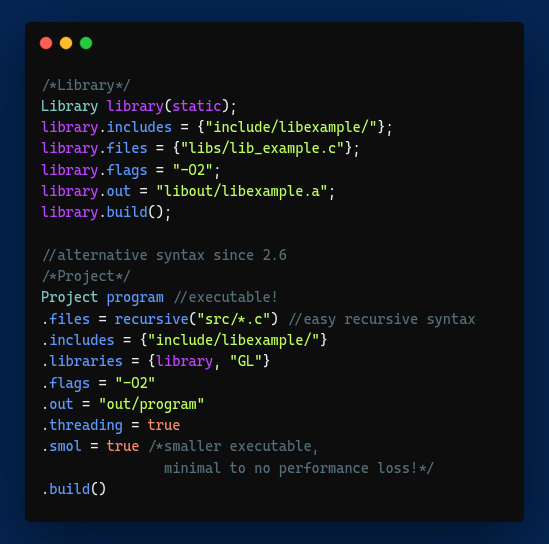

# Cate: A Build System for the sane.
<h3 align="center">
  Cate is a simple build system for C/C++ with C-like syntax.
</h3>
<p align="center">
  
</p>

## Introduction
Cate is a simple and fast build system for C/C++, its syntax is much simpler than the other build systems. While Cate is slower than Make, it's is much easier to set up and create projects and libraries with.

**Cate does not have a Windows release as of yet because of our laziness**

Unlike CMake and other build systems, Cate does not require Make and **is not** Turing complete. Cate is more like a wrapper state-machine for GCC/clang than an object oriented build system (unlike CMake), or a build system programming language (also unlike CMake).

Cate is not written in Rust and never will be; Cate has 0 memory leaks thanks to a practice known as "knowing how memory works".

Do note:
- We know the source code isn't great, it was our first project.
- Cate uses Catel, a messy file type that allows default files.
- Cate uses [robin_hood hashing](https://github.com/martinus/robin-hood-hashing), since it's 20% more efficient (on average)
- Cate **does not** support `\"` characters in string literals, nor string splitting.

## Advantages of Cate over other build systems
You may be wondering what issues Cate solves, let us clear it up for you!
1. Cate is extremely easy to learn, it doesn't require learning an entirely new language just to build a project!
2. Cate (unlike CMake) has a consistent syntax that doesn't require documentation.
3. Cate is smol, It has everything it needs and a little more to keep the 1% happy.
4. Cate, unlike Make, just cates sense!

## Installing Cate
If you're still here; that means you suffered enough CMake (or Autotools) to reconsider your life choices, Thank you for choosing Cate!

### Debian/Ubuntu
Run the following commands:
```sh
wget https://github.com/TheMilkies/Cate/releases/download/v2.5/cate_2.5-0_amd64.deb
sudo dpkg -i cate_2.5-0_amd64.deb
rm cate_2.5-0_amd64.deb
```

### Other distributions
Run the following commands:
```sh
mkdir catering
cd catering
wget https://github.com/TheMilkies/Cate/releases/download/v2.5/linux_cate_v2.5.0.zip
unzip linux_cate_v2.5.0.zip
sudo ./install.sh
cd ..
rm -rf catering
```

## Building from source
Make sure you have these installed:
- A Unix-like operating system
- A C++17 compiler (`g++` or `clang++`)
*optional*
- GNU Flex 2.6.4 or greater ([setup here](github_stuff/flex_setup.md))

### Using build.sh
Run `./build.sh`, It'll ask you if you'd like to install at the end.

### Using Cate
Run `cate`, Unlike Make; It'll automatically detect the thread count.

Use `sudo cate install` to install

## Using Cate
Cate's CLI is intuitive, but doesn't offer much. You can **not** set `cflags` with a command (unlike Autotools), but you get the minimum required to work with Cate.

### Flags (Options)
- `-tN`: Set thread count to N. Cate automatically detects thread count so this isn't required.
- `-l`: Lists Catefiles in Catefiles directory (set by Catel).
- `-D`: Disable all user-defined `system()` calls in script.
- `-S`: Smolize even if not set in script.
- `-f`: Forcefully rebuild project, by deleting its object files
- `-v`: Shows the installed Cate version. 
- `-h`: Shows help and Cate version. 

## Creating a Cate project
Create the following structure
```
cate/
  |_ build.cate

include/

src/
  |_ main.c
```

Or use the following commands
```sh
mkdir cate include src
touch cate/build.cate src/main.c
```

## Creating Catefiles (Catering)
You've come this far! Good Job!

Cate breaks most known build system conventions by forcing you to use multiple files for different targets and having a file extension (unlike CMake, Make, Autotools, and many more). For a debug build; you'll have a `debug.cate`. For a cross-platform build; you'll have a `platformname.cate`. 

### Syntax
Cate uses C-like syntax with the exception of it being a "state-machine" rather than a language. It does not support int literals (0123456789) as of yet (and hopefully forever). 

**Cate does not support** `a.property = b.property;` **syntax**

There are only two class types, `Project` and `Library`. 

Example project
```css
Project project;
project.files = {"src/main.c"};
project.includes = {"include"};
project.libs = {/*add libraries here*/};
project.flags = "/*flags here*/";
project.smol = true;
project.out = "/*out name here*/";

project.build();
```

Libraries require a parameter called `LibraryType` which can be either `static` or `dynamic`

Example library (not in example project)
```css
Library library(static)
library.files = {"src/main.c"};
library.includes = {"include"};
library.libs = {/*add libraries here*/};
library.flags = "-O2";
library.out = "out/liblibrary.a";

library.build();
```

Cate (since 2.5) does not require the object names to be repeated.
```css
Project proj;
.flags = "-O3";
.files = "src/main.c";
.build();
```

### Properties
Both classes have these properties, even if they don't make sense for the class

- `Array<String> files`: Files of the project/library. No default.
- `Array<String> incs|includes|include_paths`: Include paths of the project/library. Defaults to `"include/"` if present.
- `Array<String> defs|defines|definitions`: Definitions. Default is set by the compiler. 

- `String out`: The output file name. Defaults to identifier.
- `String compiler`: The compiler to use. Default is `cc`.
- `String std|standard`: The C/C++ standard to use. Default is set by the compiler.
- `String obj_dir|object_dir|build_dir|build_directory`: The folder it'd store object files in. Defaults to `"build"`, unless a directory named `"obj"` is present; where it'd use it.
- `String flags`: The cflags of the project/library, All object files are compiled with them. Default is empty.
- `String final_flags`: The cflags ran at the end (linking step) of the project/library's compilation. Default is empty.

- `bool link`: Whether to run the linking step or not. Default is `true`.
- `bool threading`: Whether to add `-pthread` to build command. Default is `false`. (Just syntactical sugar.)
- `bool smol|smolize`: Whether to attempt to reduce output-file's size with minimal to no performance loss. Default is `false`.

- `LibraryType type`: Type of library, `static` or `dynamic`. Gets from library "constructor".

### Class methods
- `void build()`: Builds project/library.
- `void clean()`: Deletes project/library's build directory.

### General functions
- `Array<String> recursive(String path)`: Get all files (or include paths) in path ending with an extension. Example: `project.files = recursive("src/*.c");`. 

- - `recursive()` Allows subdirectory recursion, Example: `recursive("src/**.c")`;
- `void system(String command)`: Run command. Will be skipped if user runs Cate with the `-D` flag.

### Catel
A Catel file (`.catel`) is a dumb file made to point cate at the right directory, and use a default file.

Here's an example Catel file:
```
def smol.cate
dir cate
```

## Credits
- Yogurt (Main Maintainer)
- Latte (Bug fixer)

## Special thanks
Special thanks to
- **Make** for being hard to work with, and extremely ugly.
- **CMake** for failing to be an an improvement over make, and still suffer from the same issues.
- **Autotools** for being the worst build system to ever exist. 

Without these crimes against humanity, Cate would not have existed.

Thank you; Make, CMake, and Autotools for being so terrible.