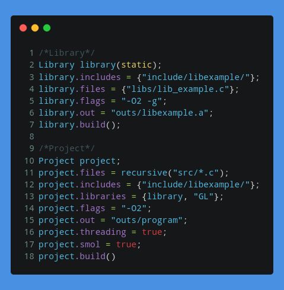

# Cate: A Build System for the sane.
<h3 align="center">
  Cate is a simple build for C/C++ with C-like syntax.
</h3>

  

## Introduction
Cate is a simple build system for the C family of languages (minus C#). While not as feature rich as CMake or as fast as Ninja-build, Cate achieves a simple syntax that doesn't feel much different to an actual programming language.

Unlike CMake, Cate is not Turing complete. It doesn't feature if-statements, loops, functions, or anything that is not related to building. 

## Notes
**Cate will change a lot in the following days, look out for updates that *might* break your project**

- Cate was written by a beginner programmer and its codebase is terrible.
- It currently doesn't support changing the amount of threads (defaults to 4 with no way to change)
- No Windows support.
- Cate uses robin_hood hashing, since it's 20% more efficient (on average)

## Building Cate
A Build system needs to be built too. this step will be easy though! 
Dependencies are:
- A *NIX operating system (Linux, BSD, MacOS, etc)
- A C++17 compiler (I used g++)
- GNU Flex 2.6.4 or greater ([read setup here](flex_setup.md))
- GNU Make (if you don't have Cate already installed)

### Building with GNU Make
To build with Make, run `make`. or if you want a smaller executable, run `make smol`
### Building with Cate
To build with Make, run `cate build.cate`,  or if you want a smaller executable, run `cate smol.cate`
### Installing
To install, use `sudo ./cate install.cate`, or `sudo make install` if you prefer installing with make.

## How to use Cate
To build another project, run `cate [filename.ending with .cate]` (example: `cate build.cate`)

For starting a project, look at the [examples folder](examples/).

## Known issues
These issues are known and will be fixed soon!
1. Very slow build times. this is due to it creating many threads instead of just checking what it needs to build and then starting threads.
2. It replaces all mentions of "lib" with an empty string. this is a mistake I made and will fix.
3. It will always rebuild if there are more files than threads.

## Credits
All Milkies have contributed in some way to Cate. Notable contributors are:
- Yogurt (Main maintainer)
- Lime (Tester and bug fixer)
- Lemon (Secondary bug fixer)
- Latte (Feature implementer) 

## How to contribute
Just make a pull request.